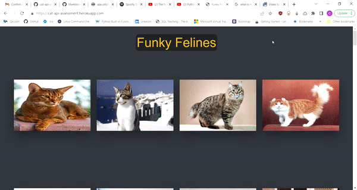
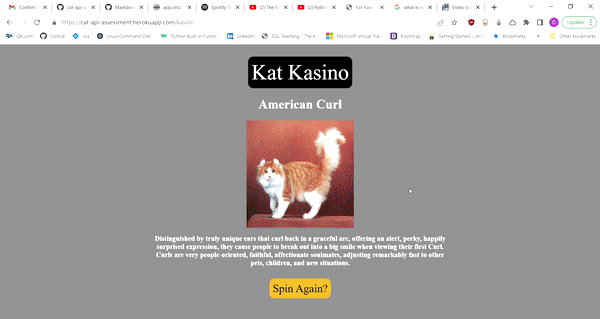

# Cat API Assessment

Small project utilizing the-cat-api for an application assessment. The live version of this app can be viewed here ->
https://cat-api-assessment.herokuapp.com/

## Contents:

- [App Design](#Appl-Design)
- [Application](#Application)
- [Known Issues](#Known-Issues)

## App Design

This project was built in Flask using Python, and was deployed via Heroku. The front end is pure HTML and CSS implemented with Jinja2 templates to allow for embedded Python code within the HTML files.

On the back end an initial HTTP request is made to the "breeds" endpoint to retrieve a list of all possible breeds, this data is then parsed for the information about each breed relevant for use within the project and all JSON objects are dumped to "data.json". Some breeds are excluded due to the fact they lacked an image url at this endpoint.

Originally this project was going to be containerised and deployed via GCP with NGINX, however this seemed like overkill and I ran into some issues along the way. Instead the project is deployed via Heroku and uses Gunicorn for the WSGI server.

## Application

There are two parts/pages to this application, navigation between pages is made possible via the header.

The index page is a collection of cards displaying an image of each breed, that when hovered over with a mouse (or clicked on mobile) displays the name, origin, and temperament of each breed.

The kasino page is a random generator that displays a breed name along with an image and short description of that breed. These details are sourced from the breed_list array that was generated during the initial GET request.

## Known Issues

- Due to the short time frame I was unable to secure the API key with an environment variable.
